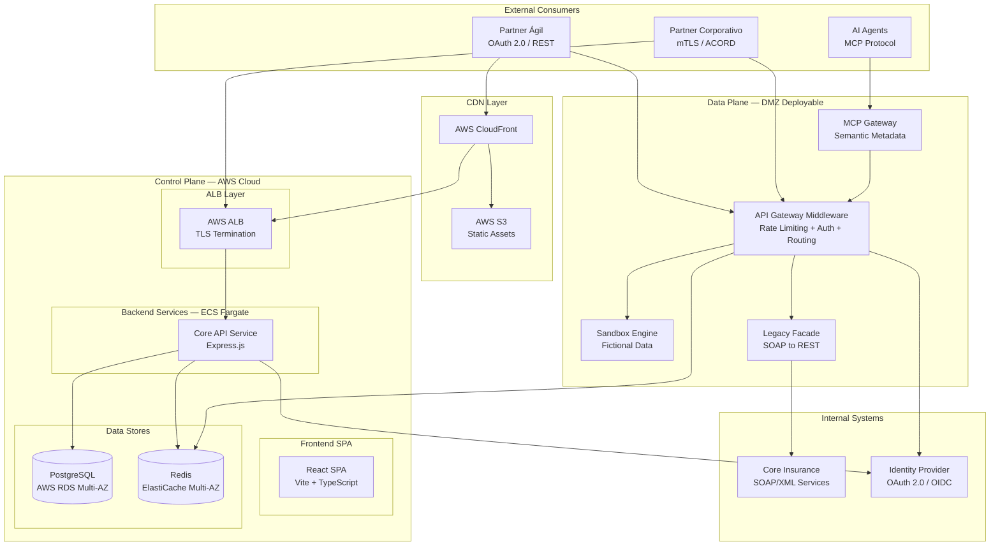
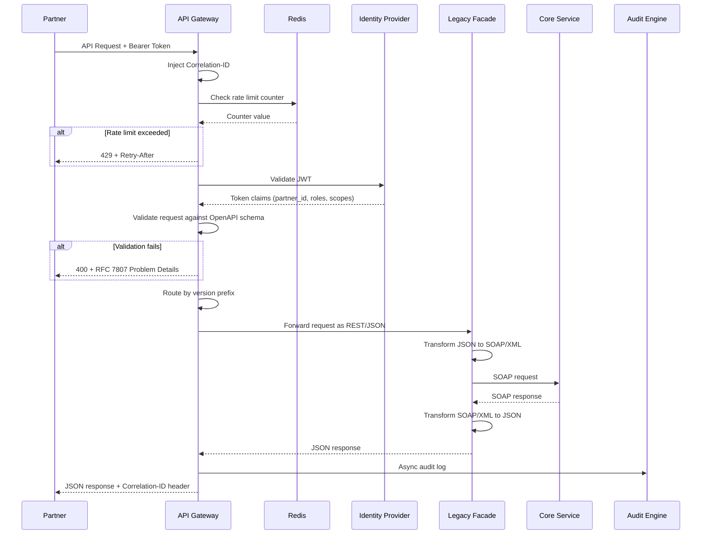
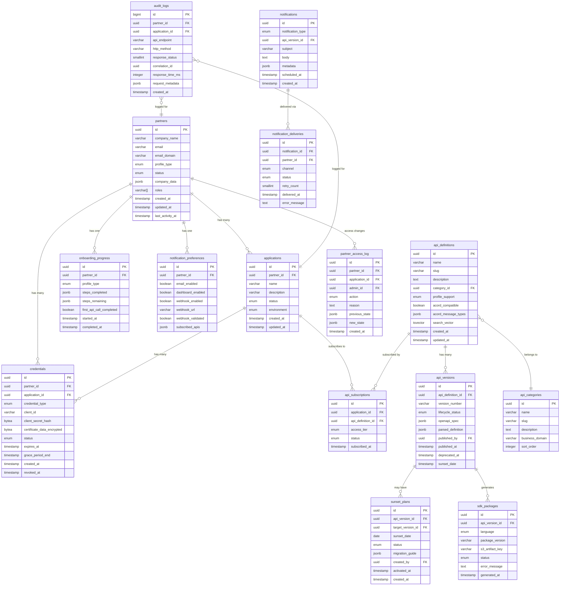

# Design Document — Conecta 2.0 Developer Portal

## Overview

Conecta 2.0 is an enterprise-grade API Developer Portal for Seguros Bolívar's Open Insurance initiative. The system enables external partners (fintechs, banks, brokers, e-commerce, insurtechs) to discover, test, and integrate insurance APIs through a self-service platform.

### Key Design Goals

1. **Minimize TTFAC** (Time to First API Call): The primary KPI — every architectural decision optimizes the path from partner registration to first successful API call.
2. **Dual-profile support**: Ágil (OAuth 2.0, REST/JSON, SDKs) and Corporativo (mTLS, ACORD, 1,500+ TPS) profiles with tailored experiences.
3. **Control Plane / Data Plane separation**: Management layer in AWS cloud, API Gateways deployable in DMZ for low-latency access to core systems.
4. **Legacy abstraction**: SOAP/XML core services exposed as modern REST/JSON APIs via a facade layer with circuit breakers.
5. **AI-ready**: MCP Gateway for AI-to-AI interactions with semantic metadata enrichment.
6. **99.95% SLA**: Multi-AZ deployment, auto-scaling, circuit breakers, and graceful degradation.

### Technology Stack

| Layer | Technology | Version |
|-------|-----------|---------|
| Frontend | React + Vite + TypeScript | 18.x / 5.x / 5.x |
| UI Components | Shadcn UI / Radix UI + Tailwind CSS | Latest / 3.x |
| Charts | Recharts | 2.x |
| Routing | React Router | 6.x |
| Server State | React Query (@tanstack/react-query) | 5.x |
| Forms | React Hook Form + Zod | 7.x / 3.x |
| Backend | Node.js + Express.js + TypeScript | 20.x LTS / 4.x / 5.x |
| Database | PostgreSQL (AWS RDS) | 15.4+ |
| Cache | AWS ElastiCache (Redis) | Latest |
| Auth | OAuth 2.0 / OIDC + JWT + mTLS | — |
| Observability | OpenTelemetry + CloudWatch | Latest |
| Infrastructure | AWS ECS Fargate, ALB, S3, CloudFront | Latest |
| Secrets | AWS Parameter Store + Secrets Manager | Latest |
| CI/CD | GitHub Actions | Latest |
| Frontend Testing | Vitest + React Testing Library | 3.x / 16.x |
| Backend Testing | Jest + Supertest | 30.x / 7.x |

### Design Decisions and Rationale

| Decision | Rationale |
|----------|-----------|
| **Monorepo with separate packages** | Frontend and backend in one repo with shared TypeScript types. Simplifies CI/CD and type safety across boundaries. |
| **Express.js over Fastify for main API** | Organizational standard (Express 4.x). Fastify considered for Data Plane gateway if throughput benchmarks require it. |
| **PostgreSQL as single primary store** | Organizational standard. Covers relational needs for partners, credentials, audit, API definitions. Redis for caching and rate limiting only. |
| **Redis for rate limiting and caching** | Token bucket counters, session cache, and analytics aggregation require sub-millisecond reads. ElastiCache provides managed Redis with multi-AZ. |
| **OpenTelemetry over custom logging** | Organizational requirement for distributed tracing. Vendor-neutral, exports to CloudWatch. Correlation-ID propagation built-in. |
| **Zod for all boundary validation** | TypeScript-first schema validation. Single source of truth for request/response types. Requirement 8.2 mandates Zod at all boundaries. |
| **node-pg-migrate for migrations** | Organizational standard for PostgreSQL migrations in Node.js projects. SQL-based, version-controlled. |

---

## Architecture

### High-Level Architecture Diagram



### Control Plane vs Data Plane Separation (Req 12.8)

**Control Plane** (AWS Cloud — ECS Fargate):
- Portal frontend (React SPA served via CloudFront/S3)
- Core API service: onboarding, partner management, analytics, audit, version governance, SDK generation, lifecycle notifications, OpenAPI parsing
- PostgreSQL (RDS) and Redis (ElastiCache) data stores
- Admin dashboards and configuration management

**Data Plane** (DMZ-deployable):
- API Gateway middleware: rate limiting, authentication, schema validation, version routing, Correlation-ID injection
- Legacy Facade: SOAP/XML to REST/JSON transformation with circuit breakers
- Sandbox Engine: fictional data generation and request processing
- MCP Gateway: AI-to-AI semantic metadata layer

The Data Plane communicates with the Control Plane via internal APIs for configuration (rate limit tiers, API definitions, partner status) and telemetry (audit logs, metrics). This allows the API Gateway to be deployed close to core insurance systems in the DMZ, achieving the less than 30ms policy processing latency requirement (Req 12.10).

### Request Flow




---

## Components and Interfaces

### Project Structure

```
conecta-portal/
├── packages/
│   ├── shared/                  # Shared TypeScript types, Zod schemas, constants
│   │   └── src/
│   │       ├── schemas/         # Zod validation schemas (shared between FE/BE)
│   │       ├── types/           # TypeScript interfaces and enums
│   │       └── constants/       # Shared constants (roles, status codes, limits)
│   ├── frontend/                # React SPA
│   │   ├── src/
│   │   │   ├── components/      # Shadcn UI components
│   │   │   ├── pages/           # Route pages
│   │   │   ├── hooks/           # Custom React hooks
│   │   │   ├── services/        # API client (React Query + Axios)
│   │   │   ├── stores/          # Client state (auth tokens in memory)
│   │   │   └── lib/             # Utilities (cn, date formatting)
│   │   ├── public/
│   │   └── vite.config.ts
│   └── backend/                 # Express.js API
│       ├── src/
│       │   ├── middleware/       # Auth, RBAC, rate-limit, correlation-id, helmet
│       │   ├── modules/         # Domain modules (see below)
│       │   │   ├── onboarding/
│       │   │   ├── catalog/
│       │   │   ├── sandbox/
│       │   │   ├── credentials/
│       │   │   ├── legacy-facade/
│       │   │   ├── analytics/
│       │   │   ├── gateway/
│       │   │   ├── mcp/
│       │   │   ├── openapi-parser/
│       │   │   ├── profile/
│       │   │   ├── sdk-generator/
│       │   │   ├── notifications/
│       │   │   ├── partner-manager/
│       │   │   ├── audit/
│       │   │   └── version-governor/
│       │   ├── lib/             # Shared utilities (logger, circuit-breaker, crypto)
│       │   ├── db/              # PostgreSQL client, migrations, repositories
│       │   └── telemetry/       # OpenTelemetry setup
│       └── jest.config.ts
├── infra/                       # IaC (Terraform/CDK) — separate concern
├── .github/workflows/           # CI/CD pipelines
└── package.json                 # Workspace root
```

Each backend module follows a consistent internal structure:

```
modules/{module-name}/
├── {module}.router.ts       # Express routes
├── {module}.controller.ts   # Request handling, Zod validation
├── {module}.service.ts      # Business logic
├── {module}.repository.ts   # Database queries (pg)
├── {module}.schema.ts       # Zod schemas for this module
├── {module}.types.ts        # Module-specific TypeScript types
└── __tests__/               # Unit and integration tests
```

### Component Catalog

#### 1. Onboarding Engine (Req 1)

**Responsibility**: Partner registration, email verification, guided onboarding flow, credential provisioning trigger.

| Endpoint | Method | Description |
|----------|--------|-------------|
| `/v1/api/onboarding/register` | POST | Submit registration form |
| `/v1/api/onboarding/verify-email` | POST | Confirm email verification token |
| `/v1/api/onboarding/progress` | GET | Get onboarding progress for current partner |
| `/v1/api/onboarding/complete-step` | POST | Mark an onboarding step as completed |

**Key behaviors**:
- Registration creates a `pending` partner record and dispatches a verification email via SES/SMTP within 5 seconds (Req 1.1).
- Email verification activates the account and initializes the profile-specific onboarding flow (Req 1.2).
- Partner_Agil completion auto-provisions OAuth 2.0 credentials and Sandbox access (Req 1.4).
- Partner_Corporativo completion creates an approval request for Admin (Req 1.5).
- Duplicate domain detection returns a suggestion to contact the existing account admin (Req 1.7).

#### 2. API Catalog (Req 2)

**Responsibility**: API discovery, search, interactive documentation rendering, profile-aware filtering.

| Endpoint | Method | Description |
|----------|--------|-------------|
| `/v1/api/catalog/apis` | GET | List APIs with filtering and pagination |
| `/v1/api/catalog/apis/:apiId` | GET | Get full API specification |
| `/v1/api/catalog/apis/:apiId/versions` | GET | List versions for an API |
| `/v1/api/catalog/search` | GET | Full-text search across APIs |
| `/v1/api/catalog/categories` | GET | List business domain categories |

**Key behaviors**:
- Renders interactive documentation from OpenAPI 3.0+ specs (Req 2.1).
- Full-text search with relevance ranking via PostgreSQL `tsvector` (Req 2.2).
- Profile-aware: highlights ACORD-compatible APIs for Corporativo partners (Req 2.4).
- Categorization by business domain and integration profile (Req 2.6).

#### 3. Sandbox Engine (Req 3)

**Responsibility**: Isolated test environment with fictional data, request/response logging, profile-tier rate limiting.

| Endpoint | Method | Description |
|----------|--------|-------------|
| `/v1/sandbox/*` | ALL | Proxy endpoint mirroring production API structure |
| `/v1/api/sandbox/logs` | GET | Retrieve sandbox request logs for current partner |

**Key behaviors**:
- Processes requests with fictional data, 100% PII masking (Req 3.2).
- Enforces same validation rules and error codes as production (Req 3.4).
- Rate limiting: Agil 100 req/min, Corporativo 500 req/min (Req 3.5).
- RFC 7807 Problem Details for malformed requests (Req 3.6).
- ACORD schema validation for Corporativo requests (Req 3.7).

#### 4. Credential Manager (Req 4)

**Responsibility**: OAuth 2.0 credential generation, mTLS CSR generation, rotation with grace period, expiration enforcement.

| Endpoint | Method | Description |
|----------|--------|-------------|
| `/v1/api/credentials` | GET | List credentials for current partner |
| `/v1/api/credentials/oauth` | POST | Generate new OAuth 2.0 client credentials |
| `/v1/api/credentials/mtls/csr` | POST | Generate mTLS CSR |
| `/v1/api/credentials/:credId/rotate` | POST | Rotate a credential |
| `/v1/api/credentials/:credId/revoke` | POST | Revoke a credential immediately |

**Key behaviors**:
- client_secret displayed only once at creation (Req 4.1).
- Rotation maintains old credential valid for configurable grace period, default 24h (Req 4.3).
- Expiration policies: access tokens 1h, refresh tokens 30d, mTLS certs 365d (Req 4.4).
- Emergency revocation invalidates all sessions within 60s (Req 4.5).
- AES-256 encryption at rest, TLS 1.2+ in transit (Req 4.6).
- Proactive expiration notifications at 30d (certs) and 7d (refresh tokens) (Req 4.7).

#### 5. Legacy Facade (Req 5)

**Responsibility**: SOAP/XML to REST/JSON bidirectional transformation, SOAP fault mapping, circuit breaker, ACORD schema conversion.

| Endpoint | Method | Description |
|----------|--------|-------------|
| `/v1/api/legacy/*` | ALL | Facade endpoints mirroring internal SOAP services |

**Key behaviors**:
- Transforms REST/JSON requests to SOAP/XML, invokes internal service, transforms response back (Req 5.2).
- Maps SOAP faults to HTTP 4xx/5xx with JSON error messages (Req 5.3).
- Circuit breaker activates after 3 consecutive failures, returns 503 + Retry-After (Req 5.4).
- ACORD XML/JSON bidirectional conversion preserving all fields (Req 5.5).
- Round-trip property: JSON to SOAP/XML to JSON produces semantically equivalent output (Req 5.6).

**Circuit Breaker Implementation**:
```
States: CLOSED -> OPEN -> HALF_OPEN -> CLOSED
- CLOSED: Normal operation, count consecutive failures
- OPEN: After 3 failures, reject all requests with 503 + Retry-After
- HALF_OPEN: After cooldown (default 30s), allow 1 probe request
- If probe succeeds -> CLOSED; if fails -> OPEN
```

#### 6. Analytics Console (Req 6)

**Responsibility**: Real-time API usage metrics, alerting, data export, admin aggregation views.

| Endpoint | Method | Description |
|----------|--------|-------------|
| `/v1/api/analytics/dashboard` | GET | Get dashboard metrics for current partner |
| `/v1/api/analytics/metrics` | GET | Query metrics with date range and filters |
| `/v1/api/analytics/export` | POST | Export metrics in CSV or JSON |
| `/v1/api/analytics/alerts` | GET | Get active alerts for current partner |

**Key behaviors**:
- Metrics: total calls, success rate, latency percentiles (p50/p95/p99), error rate, quota consumption (Req 6.1).
- Default view: last 24 hours, loads within 3 seconds (Req 6.2).
- Real-time alerting when error rate exceeds 5% over 5-minute window (Req 6.4).
- Admin view: aggregated metrics with Partner/API/profile/time filtering (Req 6.5).
- Charts rendered with Recharts, export to CSV/JSON (Req 6.6).
- Latency breakdown by endpoint, HTTP method, status code (Req 6.7).

**Metrics Pipeline**:
```
API Gateway -> OpenTelemetry Collector -> CloudWatch Metrics
                                       -> Redis (real-time aggregation)
                                       -> PostgreSQL (historical storage)
```

#### 7. API Gateway (Req 7)

**Responsibility**: Rate limiting, JWT validation, OpenAPI schema validation, version routing, Correlation-ID injection, dynamic throttling.

**Implemented as Express.js middleware chain in the Data Plane.**

Middleware execution order:
1. `correlationId` — Inject/propagate X-Correlation-ID header
2. `rateLimiter` — Token bucket per Partner ID (Redis-backed)
3. `dynamicThrottler` — Per-IP throttling for DoS mitigation
4. `authenticate` — JWT validation against IDP
5. `authorize` — RBAC scope check
6. `schemaValidator` — Validate request against OpenAPI spec
7. `versionRouter` — Route to correct API version handler
8. `auditLogger` — Async audit log dispatch

**Rate Limiting Design** (Redis token bucket):
- Key: `ratelimit:{partner_id}` with TTL = window size (60s)
- Agil default: 200 req/min, Corporativo default: 1,500 req/min (Req 7.1)
- Dynamic throttling key: `throttle:{ip}` for per-IP limits (Req 7.8)
- 429 response includes `Retry-After` header (Req 7.2)

#### 8. Security Layer (Req 8)

**Responsibility**: OWASP API Security Top 10 compliance, Zod validation, security headers, RBAC, token management.

**Cross-cutting middleware applied to all routes:**

| Middleware | Purpose | Requirement |
|-----------|---------|-------------|
| `helmet` | Security headers (CSP, HSTS, X-Frame-Options, etc.) | Req 8.3 |
| `zodValidator` | Input validation with strict Zod schemas | Req 8.2 |
| `authenticate` | OAuth 2.0 / OIDC JWT validation | Req 8.4 |
| `authorize` | RBAC role/scope enforcement | Req 8.5 |
| `cors` | Restrict origins to known domains | Req 8.1 |

**RBAC Roles**:

| Role | Scope | Description |
|------|-------|-------------|
| `Partner_Viewer` | Read-only | View APIs, docs, own analytics |
| `Partner_Admin` | Read + manage | Manage credentials, applications, team members |
| `SB_Admin` | Internal admin | Manage partners, APIs, view all analytics |
| `SB_SuperAdmin` | Full access | All SB_Admin + system configuration, version governance |

**Token Storage Strategy** (Req 8.7):
- Access tokens: stored in memory (React state/context), never persisted
- Refresh tokens: httpOnly, Secure, SameSite=Strict cookies
- No tokens in localStorage

#### 9. MCP Gateway (Req 9)

**Responsibility**: Model Context Protocol endpoint for AI-to-AI interactions, semantic metadata enrichment, API discovery for AI agents.

| Endpoint | Method | Description |
|----------|--------|-------------|
| `/v1/mcp/discover` | POST | AI agent API discovery with semantic annotations |
| `/v1/mcp/execute` | POST | AI agent API execution with metadata |
| `/v1/mcp/schema` | GET | MCP protocol schema and version info |

**Key behaviors**:
- Exposes API metadata with semantic descriptions, parameter types, examples, relationships (Req 9.1).
- Discovery returns structured catalog within 2 seconds (Req 9.2).
- Execution validates against API schema, returns response with execution metadata (Req 9.3).
- Same auth and rate limiting as standard API Gateway (Req 9.4).
- Enriched metadata: field descriptions, business context, data lineage, related APIs (Req 9.5).
- Protocol version negotiation with error on unsupported versions (Req 9.6).

#### 10. OpenAPI Parser (Req 10)

**Responsibility**: Parse, validate, render, and version OpenAPI 3.0+ specifications.

| Endpoint | Method | Description |
|----------|--------|-------------|
| `/v1/api/admin/specs` | POST | Upload OpenAPI spec (YAML or JSON) |
| `/v1/api/admin/specs/:specId` | GET | Get parsed API definition |
| `/v1/api/admin/specs/:specId/export` | GET | Export back to OpenAPI YAML |
| `/v1/api/admin/specs/:specId/versions` | GET | List spec versions |
| `/v1/api/admin/specs/:specId/validate` | POST | Validate spec without saving |

**Key behaviors**:
- Parses YAML/JSON into internal API_Definition object, validates against OpenAPI 3.0 schema (Req 10.1).
- Returns descriptive errors with JSON path and suggested fixes (Req 10.2).
- Renders interactive HTML documentation with endpoint grouping and schema visualization (Req 10.3).
- Round-trip property: parse to render to export produces semantically equivalent spec (Req 10.4).
- Versioning with diff comparison between versions (Req 10.5).

#### 11. Profile Experience Engine (Req 11)

**Responsibility**: Adapt portal UI and content based on partner integration profile.

This is primarily a frontend concern implemented via React context and conditional rendering:

- `ProfileContext` provides current profile (Agil/Corporativo) to all components.
- Dashboard layout adapts: Agil emphasizes quick-start, SDKs, webhooks; Corporativo emphasizes ACORD, mTLS, throughput (Req 11.1, 11.2).
- Profile switching without re-registration for dual-profile partners (Req 11.3).
- Documentation prioritization: Agil uses REST/JSON/GraphQL in JS/Python/Java; Corporativo uses ACORD/XML/enterprise patterns (Req 11.4, 11.5).

#### 12. SDK Generator (Req 13)

**Responsibility**: Automatic SDK generation from OpenAPI specs in JavaScript, Python, and Java.

| Endpoint | Method | Description |
|----------|--------|-------------|
| `/v1/api/admin/sdks/generate` | POST | Trigger SDK generation for a spec |
| `/v1/api/sdks` | GET | List available SDK packages |
| `/v1/api/sdks/:sdkId/download` | GET | Download SDK package |

**Key behaviors**:
- Auto-generates SDKs in JS, Python, Java within 5 minutes of spec publish (Req 13.3).
- Versioned artifacts with installation instructions and usage examples (Req 13.4).
- Regenerates on new API version, notifies subscribers via Lifecycle_Notifier (Req 13.5).
- Logs generation failures and notifies Admin within 60s (Req 13.7).

**Implementation**: Uses OpenAPI Generator CLI as a subprocess, triggered asynchronously via a job queue (Redis-backed). Generated artifacts stored in S3.

#### 13. Lifecycle Notifier (Req 14)

**Responsibility**: Proactive notifications for API lifecycle events across email, dashboard, and webhook channels.

| Endpoint | Method | Description |
|----------|--------|-------------|
| `/v1/api/notifications` | GET | Get notification history for current partner |
| `/v1/api/notifications/preferences` | GET/PUT | Manage notification preferences |
| `/v1/api/notifications/webhooks` | POST | Register webhook endpoint |
| `/v1/api/notifications/webhooks/:id/test` | POST | Test webhook delivery |

**Key behaviors**:
- Three channels: email (SES), dashboard notification center, webhook callbacks (Req 14.4).
- Webhook validation with test payload before activation (Req 14.5).
- Retry: 3 attempts with exponential backoff on delivery failure (Req 14.7).
- Notification types: new version (within 24h), maintenance (7d advance), deprecation (3 months advance) (Req 14.1-14.3).

#### 14. Partner Manager (Req 15)

**Responsibility**: Centralized partner access management with granular controls at partner and application level.

| Endpoint | Method | Description |
|----------|--------|-------------|
| `/v1/api/admin/partners` | GET | List all partners with status |
| `/v1/api/admin/partners/:id` | GET | Get partner details |
| `/v1/api/admin/partners/:id/status` | PUT | Approve/suspend/revoke partner |
| `/v1/api/admin/partners/:id/apps/:appId/status` | PUT | Manage individual app access |
| `/v1/api/admin/partners/bulk-action` | POST | Bulk suspend/reactivate |

**Key behaviors**:
- Partner-level and application-level access control (Req 15.1, 15.2).
- Suspension invalidates all credentials and sessions within 60s (Req 15.3).
- Bulk operations for multiple partners/apps (Req 15.4).
- Immutable audit trail for every access change (Req 15.5).
- Revocation notification with reason and appeal instructions (Req 15.6).

#### 15. Audit Engine (Req 16)

**Responsibility**: API consumption recording, report generation, anomaly detection, compliance.

| Endpoint | Method | Description |
|----------|--------|-------------|
| `/v1/api/admin/audit/reports` | POST | Generate audit report with filters |
| `/v1/api/admin/audit/reports/:id` | GET | Get report status/download |
| `/v1/api/admin/audit/dashboard` | GET | Real-time consumption summary |
| `/v1/api/admin/audit/anomalies` | GET | Get anomaly alerts |

**Key behaviors**:
- Records every API call: partner_id, app_id, endpoint, method, timestamp, status, correlation_id (Req 16.1).
- Report generation within 30s for up to 90 days (Req 16.2).
- Export CSV/JSON, max 60s for 1M records (Req 16.3).
- 90-day hot storage retention (Req 16.4).
- Anomaly detection: alert when partner exceeds 200% of average daily volume (Req 16.6).
- Archive retrieval for periods exceeding 90 days with extended processing notification (Req 16.7).

**Audit Data Pipeline**:
```
API Gateway middleware -> Redis stream (buffer) -> Background worker -> PostgreSQL (audit_logs)
                                                                     -> S3 (archive after 90 days)
```

#### 16. Version Governor (Req 17)

**Responsibility**: API version lifecycle management — draft, staging, production, deprecation, sunset.

| Endpoint | Method | Description |
|----------|--------|-------------|
| `/v1/api/admin/versions` | GET | List all API versions with lifecycle status |
| `/v1/api/admin/versions` | POST | Create new version as draft |
| `/v1/api/admin/versions/:id/promote` | POST | Promote draft to staging or production |
| `/v1/api/admin/versions/:id/sunset` | POST | Create sunset plan |
| `/v1/api/admin/versions/:id/sunset/activate` | POST | Activate sunset plan |
| `/v1/api/admin/versions/:id/migration-guide` | GET | Get auto-generated migration guide |

**Key behaviors**:
- Publishing workflow: draft to staging to production with approval (Req 17.1).
- Sunset plans require date at least 3 months in future + migration target (Req 17.2).
- Coordinated deprecation notices at 3 months, 1 month, 1 week via Lifecycle_Notifier (Req 17.3).
- Auto-generated migration guide with breaking changes and schema diffs (Req 17.4).
- Governance dashboard with lifecycle status and consumer counts (Req 17.5).
- Safety check: alert Admin if consumers remain at sunset date (Req 17.6).


---

## Data Models

### PostgreSQL Database Schema

The database is organized into logical schemas for separation of concerns:

- `portal` — Core portal entities (partners, applications, onboarding)
- `catalog` — API definitions, versions, categories
- `credentials` — Credential management and rotation
- `audit` — API consumption logs and reports
- `notifications` — Lifecycle notifications and delivery tracking

### Entity Relationship Diagram



### Enum Types

```sql
CREATE TYPE portal.profile_type AS ENUM ('agil', 'corporativo', 'dual');
CREATE TYPE portal.partner_status AS ENUM ('pending', 'active', 'suspended', 'revoked');
CREATE TYPE portal.app_status AS ENUM ('active', 'suspended', 'revoked');
CREATE TYPE portal.environment_type AS ENUM ('sandbox', 'production');
CREATE TYPE credentials.credential_type AS ENUM ('oauth2', 'mtls');
CREATE TYPE credentials.credential_status AS ENUM ('active', 'rotated', 'revoked', 'expired');
CREATE TYPE catalog.profile_support AS ENUM ('agil', 'corporativo', 'both');
CREATE TYPE catalog.lifecycle_status AS ENUM ('draft', 'staging', 'active', 'deprecated', 'sunset');
CREATE TYPE catalog.access_tier AS ENUM ('basic', 'standard', 'premium');
CREATE TYPE catalog.sunset_plan_status AS ENUM ('draft', 'active', 'completed', 'cancelled');
CREATE TYPE catalog.sdk_language AS ENUM ('javascript', 'python', 'java');
CREATE TYPE catalog.sdk_status AS ENUM ('generating', 'ready', 'failed');
CREATE TYPE notifications.notification_type AS ENUM ('new_version', 'maintenance', 'deprecation', 'credential_expiry', 'access_change');
CREATE TYPE notifications.channel_type AS ENUM ('email', 'dashboard', 'webhook');
CREATE TYPE notifications.delivery_status AS ENUM ('pending', 'delivered', 'failed');
CREATE TYPE audit.access_action AS ENUM ('approve', 'suspend', 'revoke', 'reactivate');
```

### Key Database Design Decisions

1. **UUIDs as primary keys**: Prevents enumeration attacks, safe for distributed systems. `bigint` used only for `audit_logs` due to high volume and sequential access patterns.

2. **`tsvector` for full-text search** (Req 2.2): The `api_definitions.search_vector` column enables PostgreSQL native full-text search with relevance ranking, avoiding the need for a separate search engine.

3. **`jsonb` for flexible data**: OpenAPI specs (`api_versions.openapi_spec`), onboarding steps, and metadata stored as JSONB for schema flexibility while maintaining query capability.

4. **Partitioned audit_logs table**: Partitioned by month on `created_at` for efficient range queries and automated archival. Hot storage covers 90 days (Req 16.4), older partitions archived to S3.

5. **Immutable access log** (Req 15.5): `partner_access_log` is append-only with no UPDATE or DELETE permissions. Captures previous and new state for full audit trail.

6. **Credential secrets never stored in plaintext** (Req 4.6): `client_secret_hash` stores bcrypt hash. The plaintext is shown once at creation and never retrievable. Certificate data encrypted with AES-256 via application-level encryption before storage.

### Indexes

```sql
-- Full-text search on API catalog
CREATE INDEX idx_api_definitions_search ON catalog.api_definitions USING GIN(search_vector);

-- Partner lookup by email domain (duplicate detection, Req 1.7)
CREATE INDEX idx_partners_email_domain ON portal.partners(email_domain);

-- Audit logs by partner and date range (report generation, Req 16.2)
CREATE INDEX idx_audit_logs_partner_date ON audit.audit_logs(partner_id, created_at DESC);

-- Audit logs by correlation ID (request tracing, Req 7.4)
CREATE INDEX idx_audit_logs_correlation ON audit.audit_logs(correlation_id);

-- Credentials by expiration (proactive notification queries, Req 4.7)
CREATE INDEX idx_credentials_expires ON credentials.credentials(expires_at)
    WHERE status = 'active';

-- API versions by lifecycle status (governance dashboard, Req 17.5)
CREATE INDEX idx_api_versions_status ON catalog.api_versions(lifecycle_status, api_definition_id);

-- Notification deliveries pending retry (Req 14.7)
CREATE INDEX idx_notification_deliveries_pending ON notifications.notification_deliveries(status, retry_count)
    WHERE status = 'failed' AND retry_count < 3;
```

### Redis Data Structures

| Key Pattern | Type | TTL | Purpose |
|-------------|------|-----|---------|
| `ratelimit:{partner_id}` | String (counter) | 60s | Token bucket rate limiting per partner |
| `throttle:{ip}` | String (counter) | 60s | Dynamic per-IP throttling |
| `session:{token_hash}` | Hash | 1h | Active session cache for fast JWT validation |
| `metrics:{partner_id}:{date}` | Hash | 48h | Real-time metrics aggregation per partner |
| `metrics:global:{date}` | Hash | 48h | Global metrics aggregation for admin dashboard |
| `circuit:{service_name}` | Hash | — | Circuit breaker state (status, failure_count, last_failure) |
| `cache:api_def:{api_id}` | String (JSON) | 5min | Cached API definition for catalog reads |
| `cache:partner:{partner_id}` | Hash | 5min | Cached partner profile and tier info |
| `queue:sdk_generation` | List | — | Job queue for async SDK generation |
| `queue:notifications` | List | — | Job queue for async notification delivery |
| `queue:audit` | Stream | — | Buffered audit log entries before PostgreSQL write |
